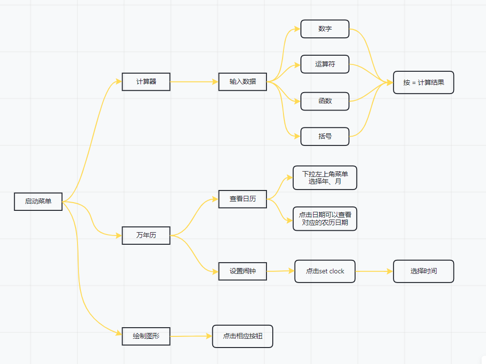

# Curriculum_Design_wyl
#### 小工具集成
- 计算器模拟设计
- 一个简单的万年历
- 用菜单和按钮来控制绘图

1. 界面设计
界面综合使用了GridPane、Pane、VBox、HBox等面板来进行总体布局，使用CSS调整节点的样式。整体效果如下：
 
2. 功能介绍（此处仅展示部分效果截图）
启动菜单：用以启动三个程序，配有退出的EXIT按钮；

- 计算器：实现了以下功能：
  - 基本的加减乘除运算
  - 乘方运算、求平均值、取模运算、求平方根、求绝对值
  - 带括号的运算
  - 解决了7.6+7.8=15.3999999的问题

- 万年历：实现了以下功能：
  - 显示当前系统时间
  - 显示公历日期及其对应的星期数
  - 显示农历对应的日期数
  - 有设置闹钟的功能，闹钟图标会有三种状态——无闹钟时、闹钟等待响铃过程中、

- 绘图：实现了以下功能：
  - 绘制直线
  - 绘制空心椭圆、实心椭圆
  - 绘制空心矩形、实心矩形
  - 绘制多边形

3. 程序流程图如下

